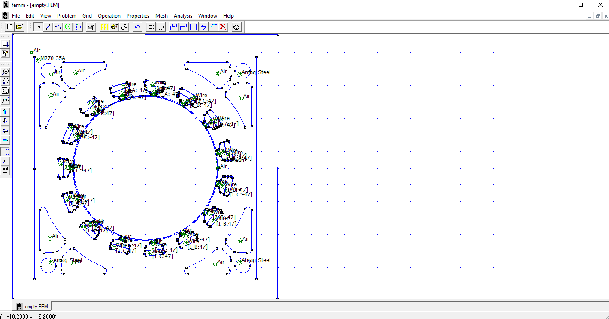

# Full automation for Salient Pole Synchronous machine rotor designs

This project is part of our approach to design a rotor with salient poles for a given stator design and resulted of our assignments for the course "Electric Machines". As for salinet poles there are a finite number of adjustable parameters, we decided that it would me most efficient to automate as many steps as possible.

## Content of this README

- [Full automation for Salient Pole Synchronous machine rotor designs](#full-automation-for-salient-pole-synchronous-machine-rotor-designs)
  - [Content of this README](#content-of-this-readme)
  - [Program flow](#program-flow)
  - [Installation and Setup of the file structure](#installation-and-setup-of-the-file-structure)
    - [Software](#software)
      - [Python and Anaconda](#python-and-anaconda)
      - [node.js and npm](#nodejs-and-npm)
      - [File structure](#file-structure)
  - [Usage](#usage)
      - [prepare the the FEMM empty stator file](#prepare-the-the-femm-empty-stator-file)
      - [defining the parameters for the iterations](#defining-the-parameters-for-the-iterations)
  - [Running the code](#running-the-code)
  - [Results](#results)

## Program flow

## Installation and Setup of the file structure

As of now the code is only compatible and tested with Windows.

Unfortunatly, the code is not ready to run out of the box. You need to install some software and create some files and folders. We will describe the necessary steps in the following.

### Software

To run the code you need to install the following software:

- FEMM 4.2
- Python
- Anaconda
- Node.js

#### Python and Anaconda

As the pyton scripts need some packages, you need to create a new environment called "copy_to_vis" in Anaconda. To do so, open the Anaconda prompt and type in the following commands:

```bash
conda create -n copy_to_vis python=3.7
conda activate copy_to_vis
```

Afterwards you need to install the following packages:

```bash
conda install -n copy_to_vis pandas
conda install -n copy_to_vis openpyxl
```

#### node.js and npm

As the node.js script needs some packages as well, you need to install them by typing in the following command in the command prompt:

```bash
npm install
```

#### File structure

As parts of the code we used is not of our personal authorship, we don´t want to puplish it on GitHub. Therefore we describe the file structure and the necessary files to run the code in the following.
The node_modules folder is automatically generated when running npm install.
All files that are marked with a \* are not part of the GitHub repository and need to be added manually.

````bash

The initial file structure is as follows:

```bash
├── analysis/ *
│   ├── calc_myfunctions.lua *
│   ├── calc.lua *
│   ├── param.lua *
│   └── Visualisierung of calc results.xlsx *
├── functions/
│   └── generateLuaContent.js
├── node_modules/ (automatically generated when running npm install)
│
├── .gitignore
├── copyToVis.py
├── empty.FEM *
├── generateCombined.py
├── generatur.lua
├── indexMultiple.js
├── iterateMultiple.json
├── package-lock.json
├── package.json
└── readme.md
````

## Usage

To run the code you need to follow the following steps:

#### prepare the the FEMM empty stator file

Create the empty stator file from the given SPMSM design by deleting everything regarding the rotor. The empty space where the rotor will be generated needs to be empty so there must not be a material defined.
Furthermore you need to define a mater curcuit called "Rotor" and define its attributes as needed - this will be the circuit for the rotor windings.
The stator file should look like this:



#### defining the parameters for the iterations

In the iterateMultiple.json file you have to define the parameters for the iterations. The values of "parameters" are the values that stay constant.
In "iterations" you can define one ore multiple parameters that will be iterated over. For each iterated parameter the respective static value will be replaced by the iterated values. For all other parameters (only exept the one (!) that is currently iterated over) the static value will be used.
An example for a defined iterateMultiple.json my look like this:

```json
{
  "parameters": {
    "innerDiameter": 6,
    "outerDiameter": 32,
    "yokeBaseWidth": 9,
    "yokeBaseHeight": 15,
    "yokeUpperWidth": 32,
    "youkeUpperOuterHeight": 5,
    "nYokes": 4,
    "FWWidth": 5,
    "FWHeight": 14,
    "padding": 0.2,
    "rotorTurns": 150,
    "rotorCurrent": 5,
    "innerStatorRadius": 44,
    "airGap": 1
  },
  "iterate": [
    {
      "parameter": "yokeBaseWidth",
      "beginAt": 5,
      "endAt": 11,
      "step": 2
    },
    {
      "parameter": "youkeUpperOuterHeight",
      "beginAt": 4,
      "endAt": 10,
      "step": 3
    },
    {
      "parameter": "rotorTurns",
      "beginAt": 100,
      "endAt": 200,
      "step": 50
    },
    {
      "parameter": "rotorCurrent",
      "beginAt": 1,
      "endAt": 9,
      "step": 2
    }
  ]
}
```

Furthermore you need to set the correct values in the /analysis/param.lua

## Running the code

After defining the parameters you can run the code by executing the run.bat file.

While the code is running, it is important that you don´t close the FEMM window or open new FEMM windows as the orchestrating indexMultiple.js script needs to control the FEMM window by frequently checking if the FEMM window is still open. Because many iterations and steps are executed, the code will take some time to finish - depending on the number of iterations, steps and resolution defined in the calc.lua file.

During the execution of the code many files and directories will be created. So don´t worry if you see a lot of files and folders being created.

## Results

After the code has finished running, you will find the results in the /iterations/ folder. For each parameter a folder will be created. Inside the respectiver folder you will find a subfolder for each iteration as well as a folder called "densityplots" - inside here for each iteration of the individual parameter a screenshot of the density plot will be saved.
Inside the iterations folders you will find every file you need for the analysis, including the "Visualisierung.xlsx" file where all results of the iteration are already inserted.
Last but not least you will find files called "M_el_combined.xlsx", ... in the /iterations folder. In these file, you campare the curves of all itearations of all iterated parameters.
